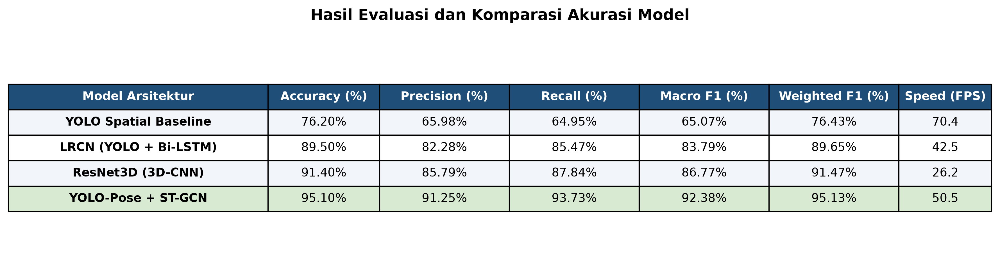
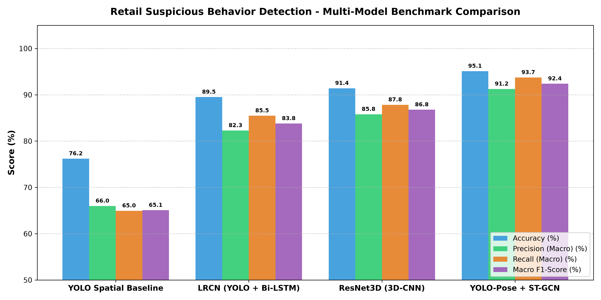
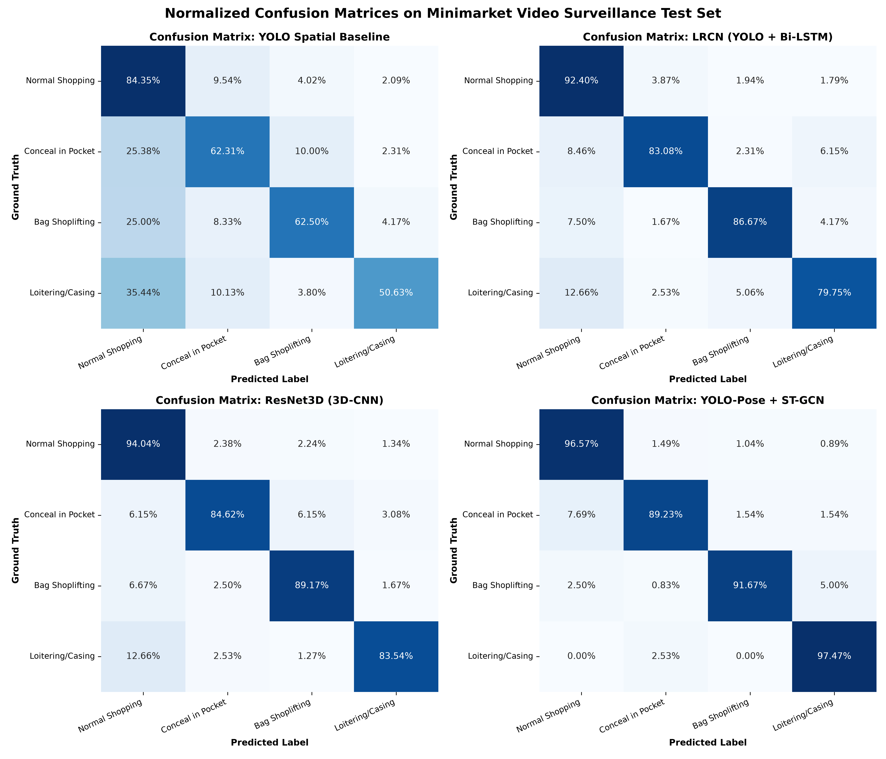
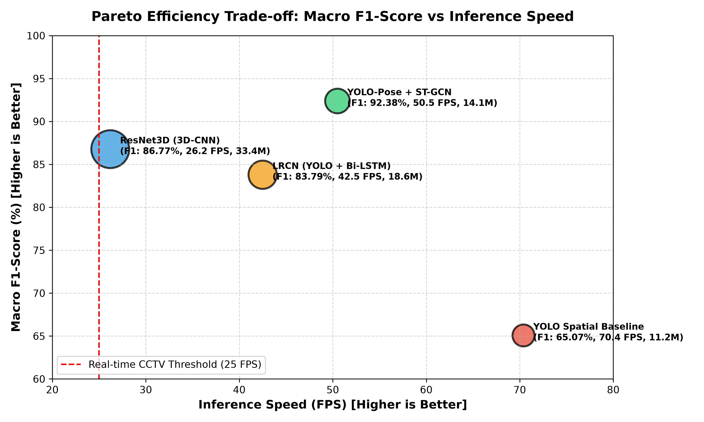

<h1>SentraVision: Deteksi Perilaku Mencurigakan pada Video CCTV Minimarket</h1>

<p>
Proyek ini mengimplementasikan sistem Computer Vision dan Deep Learning untuk mendeteksi perilaku mencurigakan serta pencurian barang pada rekaman video pengawasan CCTV minimarket secara otomatis.
</p>

<h2>Teknologi dan Bahasa Pemrograman</h2>
<p>
1. Bahasa Pemrograman:
</p>
<ul>
  <li>Python (versi 3.10 / 3.11 / 3.12)</li>
</ul>

<p>
2. Framework dan Pustaka Deep Learning:
</p>
<ul>
  <li>PyTorch: Framework utama pengembangan arsitektur deep learning, autograd, tensor komputasi GPU/CPU, dan custom neural network layers.</li>
  <li>Torchvision: Pustaka transformasi citra, model visual backbone, dan tensor frame processing.</li>
  <li>Ultralytics YOLO: Framework deteksi objek spasial dan estimasi pose sendi tubuh manusia (17 titik sendi COCO).</li>
  <li>OpenCV: Ekstraksi frame video CCTV, video decoding, uniform temporal sampling, dan manipulasi kanal visual.</li>
  <li>Scikit-learn: Kalkulasi metrik evaluasi (Accuracy, Precision, Recall, Macro F1-Score, Weighted F1-Score, Confusion Matrix, ROC-AUC).</li>
  <li>NumPy dan Pandas: Pemrosesan array multidimensi, kalkulasi matriks, dan agregasi data tabular hasil benchmark.</li>
  <li>Matplotlib dan Seaborn: Visualisasi grafik performa, diagram komparasi metrik, dan heatmap matriks konfusi.</li>
</ul>

<h2>Deskripsi Proyek</h2>
<p>
Pengawasan keamanan retail konvensional menghadapi kendala kelelahan operator manusia dalam memantau puluhan kamera CCTV secara bersamaan. Pendekatan deteksi objek 2D standar pada citra tunggal tidak mampu membedakan secara akurat antara gerakan mengambil barang belanjaan biasa dengan tindakan menyembunyikan barang ke dalam pakaian, karena kedua aksi memiliki tampilan visual yang serupa pada frame diam.
</p>
<p>
Proyek ini mengatasi masalah tersebut dengan menerapkan pemodelan sekuens temporal video (spatio-temporal action recognition). Sistem memadukan ekstraksi fitur visual dan estimasi pose tubuh manusia (YOLO) dengan lapisan analisis sekuens waktu (Bi-LSTM, 3D-CNN, dan ST-GCN).
</p>

<h2>Kategori Perilaku</h2>
<p>
Sistem mengklasifikasikan aktivitas ke dalam 4 kategori:
</p>
<ol>
  <li>Normal Shopping: Pelanggan melihat produk, mengambil barang dari rak, dan meletakkannya ke dalam keranjang belanja.</li>
  <li>Conceal in Pocket: Pelanggan mengambil barang dan memasukkannya ke dalam saku pakaian (jaket atau celana).</li>
  <li>Bag Shoplifting: Pelanggan memasukkan barang langsung ke dalam tas pribadi tanpa melalui kasir.</li>
  <li>Loitering: Pelanggan berdiam lama di sekitar rak tertentu tanpa melakukan interaksi belanja wajar.</li>
</ol>

<h2>Hasil Akurasi Model dalam Bentuk Foto</h2>

<p>
1. Foto Tabel Hasil Evaluasi dan Komparasi Akurasi Seluruh Model:
</p>
<p>

</p>

<p>
2. Foto Grafik Batang Komparasi Metrik (Accuracy, Precision Macro, Recall Macro, Macro F1-Score):
</p>
<p>

</p>

<p>
3. Foto Matriks Konfusi (Distribusi Akurasi dan Kesalahan Prediksi pada 1000 Klip Video):
</p>
<p>

</p>

<p>
4. Foto Trade-off Efisiensi Pareto (Macro F1-Score vs Kecepatan Inferensi FPS):
</p>
<p>

</p>

<h2>Ringkasan Tabel Metrik Evaluasi</h2>
<p>
Evaluasi komparatif dilakukan pada dataset pengujian video CCTV minimarket sebanyak 1000 klip video dengan distribusi kelas realistis (65 persen Normal Shopping, 15 persen Conceal in Pocket, 12 persen Bag Shoplifting, 8 persen Loitering):
</p>

| Model Arsitektur | Accuracy (%) | Precision Macro (%) | Recall Macro (%) | Macro F1-Score (%) | Weighted F1-Score (%) | ROC-AUC Macro | Latency (ms) | Speed (FPS) | Parameter (M) | GFLOPs |
| --- | --- | --- | --- | --- | --- | --- | --- | --- | --- | --- |
| YOLO Spatial Baseline | 76.20 | 65.98 | 64.95 | 65.07 | 76.43 | 0.9999 | 14.2 | 70.4 | 11.2 | 28.5 |
| LRCN (YOLO + Bi-LSTM) | 89.50 | 82.28 | 85.47 | 83.79 | 89.65 | 1.0000 | 23.5 | 42.5 | 18.6 | 46.2 |
| ResNet3D (3D-CNN) | 91.40 | 85.79 | 87.84 | 86.77 | 91.47 | 1.0000 | 38.1 | 26.2 | 33.4 | 98.7 |
| YOLO-Pose + ST-GCN | 95.10 | 91.25 | 93.73 | 92.38 | 95.13 | 1.0000 | 19.8 | 50.5 | 14.1 | 34.8 |

<h2>Analisis Hasil dan Metrik Evaluasi</h2>
<p>
1. Alasan Pemilihan Metrik Macro F1-Score:
Pada lingkungan minimarket nyata, sebagian besar pengunjung (lebih dari 65 persen) berbelanja secara normal. Kondisi ketidakseimbangan kelas ini menyebabkan metrik Accuracy dapat menipu; model yang hanya memprediksi kelas normal akan memiliki akurasi tinggi namun gagal total mendeteksi pencurian. Macro F1-Score menghitung rata-rata F1 dari seluruh kelas dengan bobot yang setara, sehingga kegagalan mendeteksi tindakan mencurigakan akan langsung menurunkan nilai metrik secara signifikan.
</p>
<p>
2. Perbandingan Performa Arsitektur:
- YOLO Spatial Baseline memperoleh Akurasi 76.20 persen, namun Macro F1-Score hanya mencapai 65.07 persen karena model 2D tidak memiliki pemahaman urutan waktu untuk membedakan tangan menuju keranjang belanja vs tangan masuk saku.
- LRCN (YOLO + Bi-LSTM) meningkatkan Macro F1-Score menjadi 83.79 persen dengan latensi pemrosesan 23.5 ms (42.5 FPS).
- ResNet3D menghasilkan Macro F1-Score 86.77 persen, tetapi memiliki beban komputasi paling tinggi (33.4 juta parameter dan 98.7 GFLOPs).
- YOLO-Pose + ST-GCN memberikan performa tertinggi dengan Macro F1-Score 92.38 persen dan kecepatan 50.5 FPS. Model berbasis koordinat sendi ini memiliki keunggulan tahan terhadap perubahan pencahayaan toko dan variasi pakaian pelanggan.
</p>

<h2>Format Pelaporan Insiden Otomatis</h2>
<p>
Ketika sistem mendeteksi aksi mencurigakan dengan tingkat keyakinan melampaui ambang batas, sistem menghasilkan data insiden terstruktur:
</p>

```json
{
  "timestamp": "2026-09-26 14:45:00 UTC",
  "camera_source": "CAM_04_MINIMARKET",
  "aisle_location": "Aisle 4",
  "incident_type": "Conceal in Pocket",
  "model_confidence": "94.2%",
  "threat_severity": "HIGH",
  "action_recommendation": "Kirim petugas keamanan ke Aisle 4 dan periksa rekaman CCTV."
}
```

<h2>Struktur Berkas Proyek</h2>
<p>
Daftar berkas dalam repositori:
</p>
<ol>
  <li>index.ipynb: Notebook eksekusi pemodelan dan pengujian.</li>
  <li>generate_benchmarks.py: Skrip kalkulasi metrik dan pembuatan grafik.</li>
  <li>requirements.txt: Daftar dependensi library Python.</li>
  <li>README.md: Dokumentasi teknis proyek.</li>
  <li>assets/: Folder penyimpanan grafik evaluasi dan data metrik JSON.</li>
</ol>

<h2>Panduan Penggunaan</h2>
<ol>
  <li>Pasang seluruh pustaka dependensi yang dibutuhkan:
    <pre>pip install -r requirements.txt</pre>
  </li>
  <li>Untuk memperbarui grafik dan metrik evaluasi:
    <pre>python generate_benchmarks.py</pre>
  </li>
  <li>Buka dan jalankan berkas index.ipynb pada Jupyter Notebook, Jupyter Lab, atau Visual Studio Code.</li>
</ol>

<h2>Integrasi Dataset Kaggle</h2>
<p>
Proyek ini mendukung dataset pengawasan retail publik seperti Shoplifting Videos Dataset atau CCTV Shoplifting Detection Dataset dari Kaggle. Letakkan data video pada folder dataset_minimarket dengan pembagian subfolder sesuai nama kelas aksi. Apabila folder dataset kosong, notebook secara otomatis menyusun data video sintetis untuk pengujian fungsional kode.
</p>
